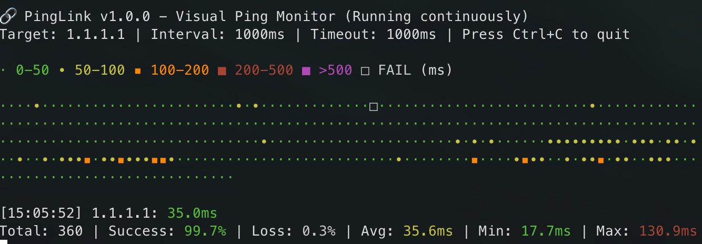

# 🔗 PingLink

A sophisticated command-line ping monitoring tool that provides real-time visual feedback of network connectivity with time-based graphical representation and comprehensive statistics.

[](https://bun.sh/)
[](https://www.typescriptlang.org/)
[](LICENSE)

## ✨ Features

- 🎨 **Visual Terminal Interface**: Size-based symbols that scale with ping latency
- ⏱️ **Real-time Monitoring**: Continuous ping monitoring with live terminal updates
- 📊 **Comprehensive Statistics**: Track packet loss, average latency, min/max values
- 🔊 **Audio Alerts**: Sound notifications for failures and recovery events
- 📈 **Intuitive Visualization**: Smaller dots for better performance, larger squares for poor performance
- 🎯 **Responsive Design**: Adapts to terminal size for optimal space utilization
- 🖥️ **Cross-Platform**: Support for macOS, Linux, and Windows
- ⚙️ **Configurable**: Customizable intervals, timeouts, sound alerts, and display modes

## 🚀 Quick Start

### Installation

```bash
# Clone the repository
git clone <repository-url>
cd pinglink

# Install dependencies
bun install

# Start monitoring (defaults to 1.1.1.1 - Cloudflare DNS)
bun ping
```

### Basic Usage

```bash
# Monitor default host (1.1.1.1)
bun ping

# Monitor Google DNS
bun ping:google

# Quick demo with fast pings
bun ping:demo

# Monitor a custom host
bun dev example.com

# Monitor with custom settings
bun dev 8.8.8.8 --interval 500 --count 20 --timeout 3000
```

## 📖 Usage

### Command Line Interface

```bash
Usage: pinglink [options] [host]

Arguments:
  host                   Host to ping (IP address or hostname) (default: "1.1.1.1")

Options:
  -V, --version          output the version number
  -v, --view <time>      Time view (5m|10m|15m|1h|6h|1d) (default: "15m")
  -i, --interval <ms>    Ping interval in milliseconds (default: "1000")
  -t, --timeout <ms>     Ping timeout in milliseconds (default: "1000")
  -s, --sound            Enable failure sound alerts (default: true)
  -f, --frequency-sound  Enable frequency-based sound feedback (default: false)
  --no-sound             Disable sound alerts
  --visual               Use advanced visual interface (default: true)
  --simple               Use simple text interface (default: false)
  -c, --count <number>   Stop after N pings (0 = infinite) (default: "0")
  -o, --output <file>    Save results to file
  -q, --quiet            Minimize output, show only failures (default: false)
  -d, --detailed         Show detailed statistics view (default: false)
  --no-color             Disable colored output
  --config <file>        Load custom configuration file
  -h, --help             display help for command
```

### Examples

```bash
# Basic ping monitoring
bun ping

# Monitor specific host with custom interval
bun dev google.com --interval 2000

# Quiet mode (show only failures)
bun ping:quiet

# Limited ping count with fast interval
bun dev 192.168.1.1 --count 50 --interval 200

# Monitor with longer timeout for slow networks
bun dev remote-server.com --timeout 10000
```

## 🎨 Visual Output

PingLink provides an intuitive size-based visualization where symbol size correlates with latency:



The interface shows:
- **Multi-row display** that fills the entire terminal
- **Size-based symbols** that scale with ping latency
- **Color-coded legend** for easy interpretation
- **Real-time statistics** including success rate, packet loss, and latency metrics
- **Historical visualization** showing network performance over time

### Text Example
```
🔗 PingLink v1.0.0 - Visual Ping Monitor (Running continuously)
Target: 1.1.1.1 | Interval: 1000ms | Timeout: 1000ms | Press Ctrl+C to quit

· 0-50 ∙ 50-100 ▪ 100-200 ■ 200-500 ■ >500 □ FAIL (ms)

······∙∙▪▪■■□□······∙∙▪

[14:32:15] 1.1.1.1: 23.4ms
Total: 156 | Success: 87.2% | Loss: 12.8% | Avg: 45.7ms | Min: 18.2ms | Max: 234.1ms
```

### Visual Legend

- **`·`** **Green**: Excellent latency (0-50ms) - Middle Dot
- **`∙`** **Yellow**: Good latency (50-100ms) - Bullet Operator
- **`▪`** **Orange**: Fair latency (100-200ms) - Black Small Square
- **`■`** **Red**: Poor latency (200-500ms) - Black Square
- **`■`** **Purple**: Very poor latency (>500ms) - Black Square
- **`□`** **Gray**: Failed ping/Timeout - White Square

### Audio Feedback

- **Single beep**: Ping failure detected
- **Double beep**: Network recovery (ping success after failures)
- **No sound**: Successful pings (unless frequency sound is enabled)

## 📝 Available Scripts

### Development
```bash
bun dev              # Run in development mode (default host)
bun dev:watch        # Watch mode for development
bun run build        # Build for production
bun run type-check   # TypeScript type checking
bun run lint         # Code linting
bun run clean        # Clean build files
```

### Quick Ping Commands
```bash
bun ping             # Ping default (1.1.1.1)
bun ping:google      # Ping Google DNS (8.8.8.8)
bun ping:cloudflare  # Ping Cloudflare DNS (1.1.1.1)
bun ping:demo        # Demo mode (20 pings, 500ms interval)
bun ping:quiet       # Quiet mode (failures only)
bun ping:detailed    # Detailed statistics view
```

### Distribution
```bash
bun start            # Run directly from source
bun run build        # Build production bundle
bun run install-global  # Install globally as 'pinglink'
```

## 🛠️ Development

### Prerequisites

- [Bun](https://bun.sh/) 1.0+
- TypeScript 5.0+

### Setup

```bash
# Clone and install
git clone <repository-url>
cd pinglink
bun install

# Development mode
bun dev

# Build for production
bun run build

# Run tests and type checking
bun run type-check
bun run lint
```

### Project Structure

```
pinglink/
├── src/
│   ├── core/
│   │   ├── ping-engine.ts          # Core ping functionality
│   │   ├── data-manager.ts         # History storage and retrieval
│   │   └── sound-engine.ts         # Audio alerts and recovery sounds
│   ├── ui/
│   │   ├── simple-graph-renderer.ts # Size-based visual ping display
│   │   ├── terminal-renderer.ts     # Advanced terminal UI
│   │   └── graph-visualizer.ts      # Graph visualization components
│   ├── utils/
│   │   ├── time-utils.ts          # Time calculations
│   │   └── color-schemes.ts       # Color palettes and visual themes
│   ├── types/
│   │   └── index.ts               # TypeScript definitions
│   ├── cli.ts                     # CLI entry point
│   └── index.ts                   # Main application
├── bin/
│   └── pinglink                   # Executable script
├── dist/                          # Compiled output
└── config/                        # Configuration files (planned)
```

## 🔧 Configuration

### Command Line Options

- **Interval**: `--interval 1000` (milliseconds between pings)
- **Timeout**: `--timeout 5000` (ping timeout in milliseconds)
- **Count**: `--count 100` (stop after N pings, 0 = infinite)
- **View**: `--view 15m` (time scale: 5m, 10m, 15m, 1h, 6h, 1d)
- **Quiet**: `--quiet` (show only failures)
- **Detailed**: `--detailed` (enhanced statistics)

### Default Configuration

```json
{
  "host": "1.1.1.1",
  "interval": 1000,
  "timeout": 1000,
  "view": "15m",
  "sound": true,
  "visual": true,
  "simple": false,
  "quiet": false,
  "detailed": false,
  "frequencySound": false
}
```

## 🌐 Supported Platforms

- ✅ **macOS** - Full support
- ✅ **Linux** - Full support
- ✅ **Windows** - Full support
- ✅ **Docker** - Works in containers

## 📊 Statistics

PingLink tracks comprehensive network statistics:

- **Total Pings**: Count of all ping attempts
- **Success Rate**: Percentage of successful pings
- **Packet Loss**: Percentage of failed pings
- **Average Latency**: Mean response time
- **Min/Max Latency**: Fastest and slowest response times
- **Real-time Updates**: Live statistics during monitoring

## 🚧 Roadmap

### Phase 2 - Visual Interface ✅ Complete
- [x] Size-based symbol visualization
- [x] Terminal-optimized display
- [x] Responsive layout with terminal adaptation
- [x] Intuitive color-coded legend

### Phase 3 - Audio System ✅ Complete
- [x] Sound alerts for failures
- [x] Recovery notification sounds
- [x] Cross-platform audio support
- [x] Configurable sound settings

### Phase 4 - Time Management (Planned)
- [ ] Historical data persistence
- [ ] Multiple time view switching
- [ ] Data aggregation system
- [ ] Export functionality

### Phase 5 - Advanced Features (Planned)
- [ ] Multiple target monitoring
- [ ] Configuration file system
- [ ] Network topology discovery
- [ ] Performance optimizations
- [ ] Multi-row visualization for large terminals

## 🤝 Contributing

Contributions are welcome! Please feel free to submit a Pull Request.

1. Fork the repository
2. Create your feature branch (`git checkout -b feature/amazing-feature`)
3. Commit your changes (`git commit -m 'Add amazing feature'`)
4. Push to the branch (`git push origin feature/amazing-feature`)
5. Open a Pull Request

## 📄 License

This project is licensed under the ISC License - see the [LICENSE](LICENSE) file for details.

## 🙏 Acknowledgments

- Built with [Commander.js](https://github.com/tj/commander.js) for CLI parsing
- Styled with [Chalk](https://github.com/chalk/chalk) for terminal colors
- Powered by [TypeScript](https://www.typescriptlang.org/) and [Bun](https://bun.sh/)

## 📞 Support

If you encounter any issues or have questions:

1. Check the [Issues](https://github.com/username/pinglink/issues) page
2. Create a new issue with detailed information
3. Include your OS, Bun version, and command used

---

**Happy Pinging!** 🏓✨
